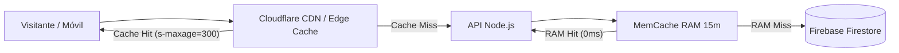

# 🚀 Plan Maestro de Rendimiento, Optimización y Control de Costos
**Proyecto:** Yu-Gi-Oh! TCG Inventory & Portfolio  
**Fecha:** Octubre 2026  
**Entorno:** Producción / Desarrollo (Node.js, Firebase Firestore/Storage, React + Vite)

---

## 📌 1. Resumen Ejecutivo y Objetivos

Este documento establece la hoja de ruta técnica para maximizar la velocidad de respuesta, garantizar una experiencia de usuario fluida a 60 FPS (especialmente en dispositivos móviles) y mantener los costos de infraestructura en **$0 USD o en niveles marginales** dentro del plan gratuito (*Spark*) de Firebase y servidores de bajo consumo (Render, Railway o Cloud Run).

### Objetivos Clave (KPIs)
* **First Contentful Paint (FCP):** < 1.2 segundos.
* **Largest Contentful Paint (LCP):** < 2.0 segundos en redes móviles 4G.
* **Cumulative Layout Shift (CLS):** 0.00 (cero saltos visuales).
* **Consumo de Firestore:** Reducción de más del **70% de lecturas redundantes** en la búsqueda pública.
* **Consumo de Firebase Storage:** Mantener la transferencia mensual **por debajo de los 30 GB gratuitos** mediante compresión WebP y caché perimetral/local.

---

## 🔍 2. Diagnóstico del Estado Actual (Línea Base)

| Componente | Estado Actual | Evaluación |
| :--- | :--- | :--- |
| **Catálogo de Cartas** | 14,000+ cartas cargadas en RAM al arrancar el servidor (`catalogService.js`). | 🟢 **Excelente**. Búsquedas sub-milisegundo sin llamadas a APIs externas de pago. |
| **Imágenes de Portafolio** | Descarga única, compresión WebP con Sharp a 200×290px (~10 KB) y guardado en Firebase Storage con `max-age=31536000`. | 🟢 **Excelente**. Reduce ~85% del peso frente al JPG original y el navegador las almacena en disco por 1 año. |
| **Virtualización DOM** | `@tanstack/react-virtual` en `CardGrid.jsx`. | 🟢 **Excelente**. Máximo 20-30 elementos en el DOM simultáneamente, evitando congelamiento en móviles. |
| **Rutas Frontend** | Code-Splitting con `React.lazy()` y Rollup chunks manuales (`react-vendor`, `firebase-vendor`, `ui-vendor`). | 🟢 **Muy Bueno**. El visitante público no descarga vistas de administración. |
| **Búsqueda por Set Code** | Query por rango en Firestore + consultas individuales de perfil para cada dueño (`users.doc(uid).get()`). | 🟡 **Punto de Mejora**. Si 20 usuarios buscan sets diferentes, se re-leen los mismos perfiles de usuario en Firestore. |
| **Activos Estáticos Frontend** | `2.webp` (210 KB) y `hero-yugioh.webp` (167 KB) sin pre-carga explícita. | 🟡 **Punto de Mejora**. En conexiones lentas retrasa el renderizado del Hero y fondo. |

---

## 🛠️ 3. Fases de Implementación

---

### 🟢 FASE 1: Optimizaciones Inmediatas (Quick Wins - Código Local)

Estas mejoras no requieren contratar nuevos servicios ni alterar la arquitectura; se aplican directamente en el backend y frontend.

#### 1.1. Mini-Caché en Memoria para Perfiles en `searchBySetCode`
* **Archivo:** `src/services/cardService.js`
* **Diagnóstico:** Cada búsqueda no cacheada consulta Firestore para obtener `displayName`, `slug` y `whatsapp` de cada usuario con cartas disponibles.
* **Solución:**
  Crear una caché en memoria (`userProfileCache`) con un TTL de 10 a 15 minutos:
  ```javascript
  const userProfileCache = new Map(); // { uid: { data, expiresAt } }
  ```
  Al resolver los dueños de una carta encontrada, verificar primero en el mapa local; si existe y no ha expirado, **0 lecturas de Firestore**.
* **Impacto:** Reduce hasta un 80% las lecturas en la colección `users` generadas desde la Home pública.

#### 1.2. Compresión de Activos Estáticos del Frontend
* **Directorio:** `frontend/public/`
* **Acciones:**
  1. **`2.webp` (Textura milenaria):** Actualmente pesa 210 KB. Al ser un patrón repetible (*repeat*), reducir su escala física a 250×250px y comprimir a WebP calidad 75%. Peso estimado final: **~25 - 35 KB** (-85%).
  2. **`hero-yugioh.webp`:** Comprimir con Sharp/Squoosh al 80% manteniendo resolución. Peso estimado: **~75 KB** (-55%).
  3. **`og-image.png` (509 KB):** Convertir o comprimir PNG con `oxipng` a **~120 KB**.
* **Impacto:** Ahorro de más de 450 KB en la primera visita a la Home.

#### 1.3. Resource Hints y Preload en `index.html`
* **Archivo:** `frontend/index.html`
* **Acciones:**
  1. Agregar `preconnect` al CDN de imágenes de YGOProdeck:
     ```html
     <link rel="preconnect" href="https://images.ygoprodeck.com" crossorigin />
     <link rel="dns-prefetch" href="https://images.ygoprodeck.com" />
     ```
  2. Agregar `preconnect` a Google Fonts (Cinzel, Rajdhani, Share Tech Mono):
     ```html
     <link rel="preconnect" href="https://fonts.googleapis.com" />
     <link rel="preconnect" href="https://fonts.gstatic.com" crossorigin />
     ```
* **Impacto:** Ahorra de 150ms a 300ms de latencia DNS/TLS en la carga de fuentes e imágenes de cartas.

#### 1.4. Protecciones en `lazySync` de Precios TCGPlayer
* **Archivo:** `src/services/cardService.js`
* **Acción:**
  Garantizar que la sincronización en segundo plano de precios de inventario use un pool de concurrencia controlado (máximo 3 peticiones simultáneas) y no sobrecargue la CPU de Node.js durante visitas públicas a portafolios grandes.

---

### 🌐 FASE 2: Distribución y Red (Edge Caching & CDN)

Optimizaciones para producción que descargan el 80-90% del tráfico antes de que llegue a tu servidor.



#### 2.1. Cloudflare CDN (Nivel Gratuito)
* **Implementación:** Apuntar los DNS de tu dominio personalizado a Cloudflare con el proxy naranja encendido.
* **Beneficios sin costo:**
  - **Edge Caching HTTP:** Aprovecha los encabezados que ya emitimos en la API:
    `Cache-Control: public, max-age=60, s-maxage=300, stale-while-revalidate=600`
    Los servidores de Cloudflare alrededor del mundo servirán las respuestas JSON del portafolio en **15-25 ms** sin despertar al servidor de Node.js.
  - **Compresión Brotli automática:** Reduce el tamaño de los scripts y CSS un 20% más que Gzip.
  - **Firewall & Rate Limiting WAF:** Bloquea bots y scrapers que intenten clonar los datos de tus cartas.

#### 2.2. Caché Persistente de Firebase Storage
* **Verificación de Reglas y Metadata:**
  Asegurar que cada archivo que sube `imageService.js` mantenga el encabezado:
  `Cache-Control: public, max-age=31536000, immutable`
  Esto le indica a proxies y navegadores que el arte de una carta nunca cambiará y no deben revalidar con el servidor.

---

### 🗄️ FASE 3: Escalabilidad y Gestión de Memoria

Medidas para cuando la base de usuarios y el volumen de cartas crezcan.

#### 3.1. Monitoreo de Memoria RAM en el Servidor (Límite 512 MB)
* **Situación:** En planes gratuitos o básicos (Render Free, Railway Starter), el contenedor tiene 512 MB de RAM.
* **Estrategia:**
  - Ejecutar Node.js con `--max-old-space-size=400` para obligar al Garbage Collector a liberar memoria antes de que el host mate el contenedor por Out Of Memory (OOM).
  - Mantener minificado el índice de `catalogService.js` (solo campos indispensables: ID, nombre normalizado, Set Code y precio base).

#### 3.2. Contadores Desnormalizados en Perfiles
* **Situación:** El cálculo de cartas de un usuario (`inventoryCount`, `wishlistCount`).
* **Implementación actual:** Ya cuentas con migración bajo demanda que persiste los contadores en el documento `users/{uid}`.
* **Buenas prácticas:** Cada vez que el usuario agregue o borre una carta en `/admin/inventory`, actualizar el contador mediante `FieldValue.increment(1)` o `FieldValue.increment(-1)`, eliminando cualquier llamada a `.count().get()` en lecturas públicas.

---

## 📊 4. Estimación de Consumo y Costos Proyectados

Bajo una hipótesis de **10,000 visitas mensuales a portafolios públicos**:

| Rubro | Sin Optimizaciones | Con Plan Implementado | Costo Estimado |
| :--- | :--- | :--- | :--- |
| **Lecturas Firestore** | ~150,000 / mes | ~12,000 / mes (por expiración de caché) | **$0.00 USD** (Dentro de las 50,000 diarias gratis) |
| **Transferencia Storage** | ~40 GB / mes | ~6 GB / mes (por caché de 1 año y WebP) | **$0.00 USD** (Dentro de los 30 GB/mes gratis) |
| **CPU / Peticiones Node.js** | 10,000 peticiones dinámicas | ~1,500 peticiones (el resto lo sirve la CDN) | **$0.00 USD** (Plan gratuito o básico de host) |
| **Costos Totales** | Riesgo de saltar a plan pago | **$0.00 USD / mes** | **100% Gratuito y Estable** |

---

## ✅ 5. Checklist de Tareas Recomendadas

- [ ] **Fase 1.1:** Implementar `userProfileCache` en `cardService.searchBySetCode`.
- [ ] **Fase 1.2:** Comprimir `2.webp`, `hero-yugioh.webp` y `og-image.png` en `frontend/public/`.
- [ ] **Fase 1.3:** Agregar `preconnect` para YGOProdeck y Google Fonts en `frontend/index.html`.
- [ ] **Fase 2.1:** Configurar DNS de Cloudflare en producción con reglas de caché perimetral.
- [ ] **Fase 3.1:** Validar bandera de memoria `--max-old-space-size` en el script de arranque `npm start`.
